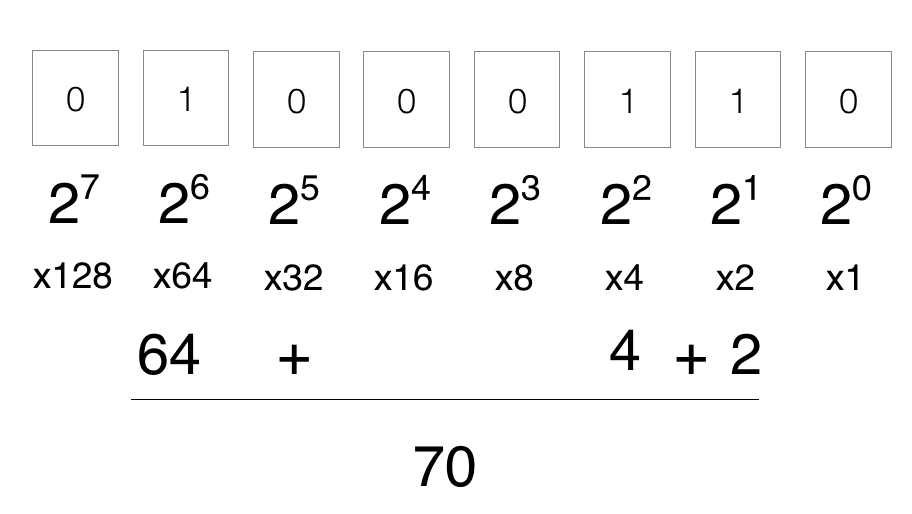

<button onclick="window.location.href='https://www.youtube.com/watch?v=RrJXLdv1i74&ab_channel=PracticalNetworking';" style="background-color: #FFFFFF; color: black;">Binary Review</button>

# The World of Binary

## Introduction

Welcome to the fascinating realm of binary, the language of computers. In this digital universe, everything is expressed in a series of 0s and 1s, creating a foundation for the complex operations that power our technological world.

## Basics of Binary

Binary is a numeral system with only two digits: 0 and 1. Each digit is called a bit, and they form the building blocks of all digital information. It's the fundamental language that computers use to process and store data.

## Binary Representation

In binary, each digit's value is a power of 2. Starting from the rightmost digit, the values double as you move to the left. This elegant simplicity allows computers to represent and manipulate data with remarkable efficiency.

## Bytes and Beyond

Computers organize binary digits into groups of eight, known as bytes. Bytes are the foundation of digital information storage and retrieval. Every character, instruction, or piece of data is encoded using a combination of these 8-bit sequences.

## Real-World Applications

Understanding binary is crucial for anyone delving into computer science, programming, or digital technology. It enables us to comprehend the inner workings of computers, from basic arithmetic to complex algorithms.

## The ASCII Code

One practical application of binary is the ASCII (American Standard Code for Information Interchange) system. ASCII assigns unique binary codes to characters, allowing computers to represent text, numbers, and symbols.

