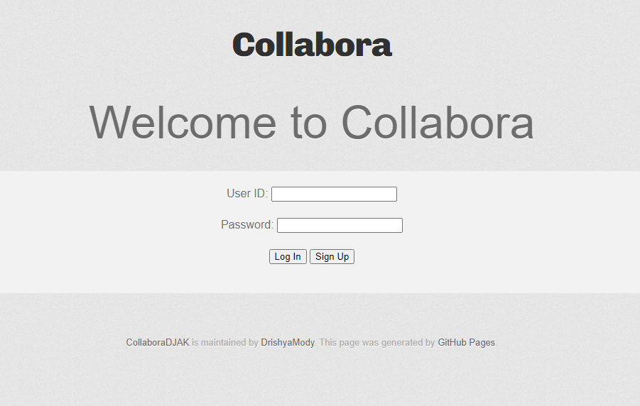

## Project Planning:
<body>

    <h1>Table of Features</h1>

    <table border="1">
        <tr>
            <th>Feature</th>
            <th>Description</th>
        </tr>
        <tr>
            <td>Login and Sign Up page</td>
            <td>Users will be able to sign up and create customized accounts with their own usernames and passwords, along with a date of birth for extra information. They will be able to access the site and ask questions and comment following their signup.</td>
        </tr>
        <tr>
            <td>Question asking</td>
            <td>Users will be given the opportunity to ask questions regarding certain academic topics/subjects. These questions may be about upcoming tests, studying for AP exams, and where to find tutorials for concepts in their classes.</td>
        </tr>
        <tr>
            <td>Commenting</td>
            <td>Users can comment on other users' questions. This may include elaborating on the question or giving their own personal insight to give a response from peer to peer. Instructors may also answer questions about the subjects they teach, regardless of the school the question asker is from.</td>
        </tr>
        <tr>
            <td>Search</td>
            <td>Users can search for certain subjects they are wondering about to see the feedback others have gotten while asking similar questions. Searching key words will prompt questions that have similar subjects.</td>
        </tr>
        <tr>
            <td>Updating User Info</td>
            <td>Users will be able to manually update their own information. This can support students that may go by certain names or have nicknames they adopt later into having their account, creating an inclusive environment for students to feel safe in.</td>
        </tr>
        <tr>
            <td>Deleting users</td>
            <td>Provides users the option to delete their account from our database should they not trust what they see or want to pursue other options for academic help.</td>
        </tr>
    </table>

</body>

## Feature preparation examples:

### Login page:
- users will be given a login button or signup button
- inputs for username and passoword
- 

### User Update
- users given boxes to type new info into for future updates to their profile
- 